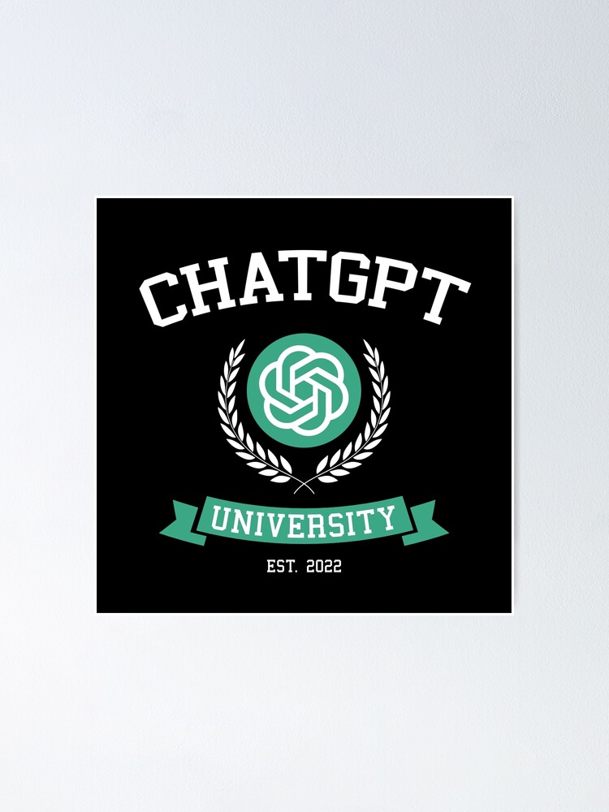

  

### I. Introduction

The rise and impact of AI or Artificial Intelligence has revolutionized the current state of the world. Its movement since 2022 has popularized the internet for reshaping the learning process, enhancing technology, and enabling fathomless insight into using tools across all open sources of the internet. Given this topic, I want to share my experience through the semester of ICS 314 and how it helped me view the aspects of using AI.

### II. Personal Experience with AI:

I have used AI in class this semester in the following areas:

  1. Experience WODs e.g. E18:

     At the beginning of the semester, I didn't use any AI or open-source intelligence websites because I already knew how to do some of the WODs from previous classes. But as soon as the assignments got harder, it was difficult for me to understand my mistakes, and I had to use ChatGPT. I've only used ChatGPT throughout the whole semester.
    
  2. In-class Practice WODs:
    
     I used ChatGPT for some in-class practice WODs, but there were some that I didn't have to because there were assignments that were very similar to the WODs. I took this opportunity as an advantage to prepare what to expect for the real WODs on the upcoming day.

  3. In-class WODs:

     In most cases, I used ChatGPT towards the middle and the end of the semester. When we started working on websites using React and Meteor, I needed assistance in making the pages and tabs. Compared to the practice WODs, there's always a bit more spice to them. 

  4. Essays:

     I have never used AI in my essays. I write essays with my own thoughts and personal feelings. I don't need AI to assist me with essays.

  5. Final project:
     
      ChatGPT has helped me through all three milestones. With the help of AI, our website would haven't looked better than before. Functioning than before, and I am proud of using AI.

  6. Learning a concept / tutorial:

      Since I got used to using ChatGPT, I felt that any questions I had in ICS 314 were answered in ChatGPT. It was easier and faster to get the information I wanted.

  7. Answering a question in class or in Discord:

      Ironically, I'm always the one who ask the questions in discord and I hope for an answer. And I ask the questions because sometimes ChatGPT failed to understand and answer the questions I was asking.

  8. Asking or answering a smart-question:

      I wasn't participating in the helping but more of asking for help. I don't ask a smart-question because I was more straightforward with my question. I didn't use AI to help me create a smart question.

  9. Coding example e.g. “give an example of using Underscore .pluck”:

      There were instructions given to me by the professor that I did not need to ask AI to give me an example of a code. The instructions provided an example for me in which I understood immediately on how to use the code for my program.

  10. Explaining code:

      I believe that the only time I would use AI to explain my code is when I have to comment in my program.
      
  11. Writing code:

      I mentioned that I used ChatGPT to make pages and tabs for my website, but that is only specific parts of the program and not whole.

  12. Documenting code:

      I did not used ChatGPT to write documentation codes this semester.

  13. Quality assurance:

      As for quality assurance, I can rely that on ESLint errors to inspect my code and I can fix the issue from there. 
      
  14. Other uses in ICS 314 not listed above:

      None.

### III. Impact on Learning and Understanding:

AI is an incredible tool to use, but at what cost? Throughout my whole semester, AI has butchered my learning ability and understanding of the lessons that were taught. Although it was a helping hand and I appreciate the help, I am more disappointed in myself. But what I took from this learning is that AI has grown into me and it has given me a skill to use on the side if I need help.

### IV. Practical Applications:

Putting AI in a practical application says that it has brought into a new level of the educational system. Although from what it seems, it has majorly impacted the whole world into using AI, as from what I have seen in many media. Not only does it affect the computer world, but in many physical states that humans can build. The perfection of using facial recognition is astonishing but frightening. For one example, there have been many instances in which fraudulent images have gone viral across the internet. One can easily alter and manipulate to generate images that were before non-existent. Recently, AI images of celebrities, Katy Perry and Rhianna, went viral on social media implying that they had attended the Met Gala.

### V. Challenges and Opportunities:

In the many trials of using ChatGPT, I have encountered many false answers to be received. There is so much information on the internet. Too many to find what is exactly correct and what is the one to be true. And I believe that AI cannot find what is real. I don't believe AI can't be stopped as it progresses tremendously in this modern world. Students who use AI will grow to find facts to be unreal and fake.

### VI. Comparative Analysis:

AI-enhanced techniques are transforming how software engineering is taught, customizing the learning experience to fit each student's strengths and weaknesses, adapting to different ways of learning, and giving immediate feedback on coding tasks. These methods engage students with interactive tools like gamified platforms and virtual reality simulations, resulting in better understanding and memory retention.

### VII. Future Considerations:

The state of AI right now, it's a great start with a lot of issues, but in the future, it will be promising and I can imagine the learning and education system to change. But we should be mindful to not fully trust and rely on AI as it might come with several disadvantages.

### VIII. Conclusion:

In conclusion, my encounter with AI throughout my ICS 314 journey has been profound, learning the capabilities and implications of using this technology. Recognizing both its advantages and disadvantages has not only improved my experience in the course but also equipped me with insights applicable beyond the classroom. The diverse impact of AI extends far beyond academic settings, highlighting the need for a subtle understanding and thoughtful integration to navigate its complexities responsibly in real-world contexts
