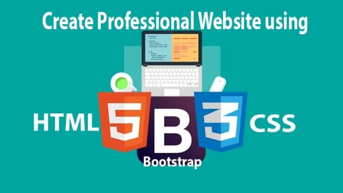

## Semester Review

Having just completed ICS 314, I want to share what I learned about software engineering from the course. In fact, this has to be one of my first and best experiences in taking in-person classes. These lessons have taught me a few critical things about being a software engineer. There are two fundamental concepts to consider: ethics and coding standards.

## Standards are Necessary

Coding Standards are a priority when it comes to programming. They are the rules of the path for developers, which help guide us through the twists and turns of software creation. From formatting our codes to naming conventions, they help everyone ensure we speak the same language and maintain clarity in our codes. Comments and documentation are somewhat the tables of contents of a book. It's very effective for developers to see through the complexities of their creations. In my experience, I use comments and documentation because I write a lot of pages and lines of code. As software engineers, computer scientists, etc., these standards aren't just about syntax but are more like a culture.

## Designing User Experiences

I have journeyed through experiences with many different types of UI frameworks. I can mention that I've done Bootstrap 5, React, and Meteor. Over the years in college, I was very excited to learn how to make websites. Bootstrap 5, React, and Meteor each contribute to web development in their own way. Bootstrap 5 provides developers with a wide range of tools and components to create visually attractive user interfaces. React is a JavaScript library that helps developers build interactive UI for web applications. And Meteor, which develops in JavaScript, not only in applications and web browsers but mobile devices too. These are powerful toolkits that allow developers to create websites such as this website.

## Final Thoughts

In summary, my journey through ICS 314 has come to an end, but it has also been enlightening and offered many profound insights into the world of software engineering. From the importance of adhering to coding standards and ensuring clarity and consistency in our codebase to the exploration of UI frameworks like Bootstrap 5, React, and Meteor, each lesson has given me a great understanding of the field. I am grateful for the opportunity in this course to search deeper into the complexities of software engineering, and I can see myself applying these learnings in my future endeavors.
