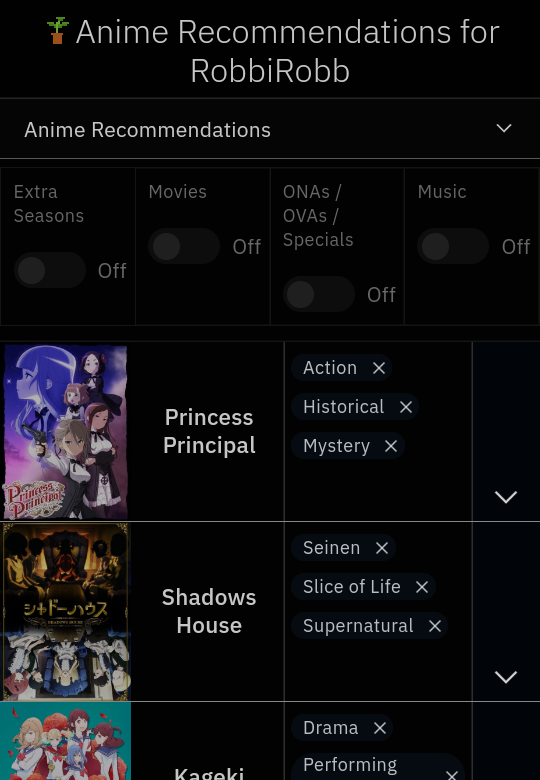
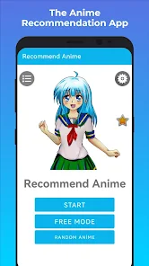

  
  

During highschool, I took AP Computer Science in my Senior year. My friend and I created an app called Anime Recommends. It was a final project for that class, and it was my idea for the topic. As the title implies, it's an app that recommends anime to you. I thought it would seem easy to make because it would suggest making a lot of switches and parameters. It's somewhat similar to other apps that people may know, like Crunchyroll and Funimation, except it was my friend and I's version.

How does the app look like? What do you need it to do to let it recommend you anime? Basically, it looks like the second photo above. Our main concern wasn't how the app looked, but how well it worked and whether it followed instructions. We wanted the program to have the user choose the options listed from the each questions, and then it will recommend an anime. The questions were "What genre would you like?" and "How many episodes would you like to watch?" At the time, we could only type what we can add into the list. I could only add 50 anime names and the amount of episodes. My partner and I communicated a lot in order for us to know what part we should work on the app. The project took us about two days for the app to work but a few more hours on making the app a bit appealing. This was my best work yet, and I was very proud of this project.
