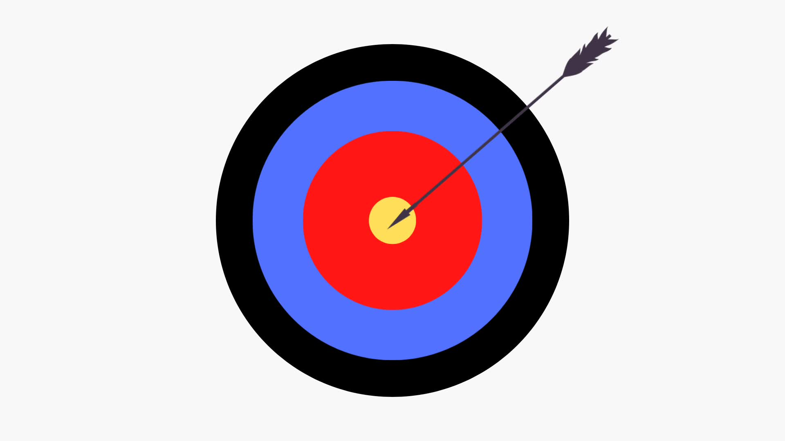
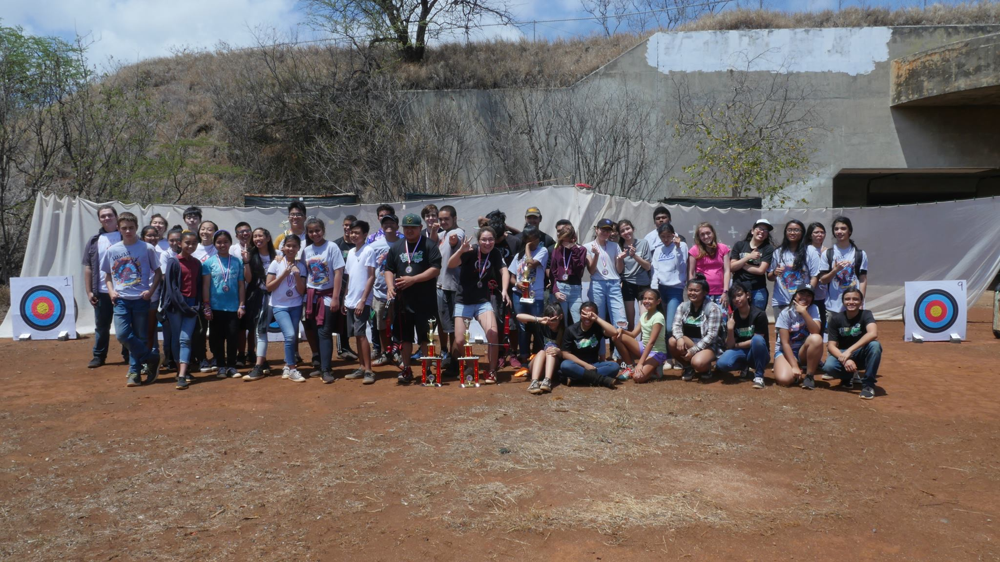

At the start of my high school years, I wanted to get involved in my school's activities. I didn't want to feel that I just only went to school just to attend classes. The school had a festival on the first day of school, and they opened up a lot of opportunities for students to join sports and clubs. What caught my eye was the archery club because it wasn't really much of a physical sport. Back then, I didn't like running around or working too much sweat. I know that people would stay late after school, and I was not in for that.

My Freshmen year was not off to a great start for me. Every Monday through Friday, except Wednesday, the club would practice for an hour. I did my best to work hard at each practice. Unfortunately for me, I came in second to last place in the tournament. It was very embarressing for me because my Dad and my stepmom came with me to watch. But it didn't make me feel bad about myself. I met a very great friend that day who happens to be first place in that tournament. It was funny because I made it think he was my rival so it highly inspired me to perform better the following year after that competition.

And so I did; during my sophomore year, I really improved. The same amount of practice, but I found so many new methods that helped me aim my bow and arrows with accuracy. You wouldn't think that I've changed that much since that year, bullseye after bullseye. Excitedly motivated for the upcoming tournament, but this time, I was placed in 5th place, tied with another person. I was even more motivated to do better next year. I believed I could go for 1st place. But sadly, it got cancalled due to Covid-19.
