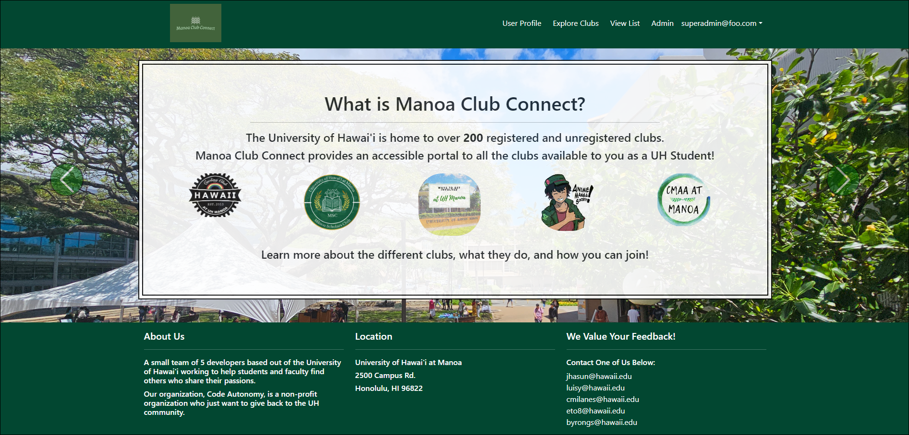
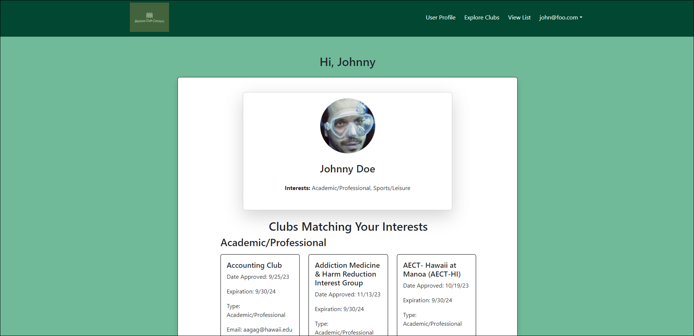
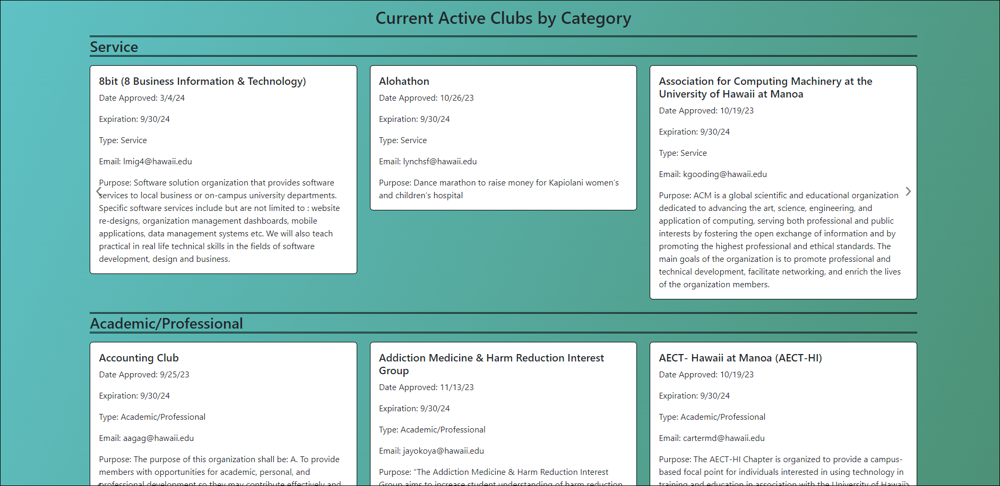
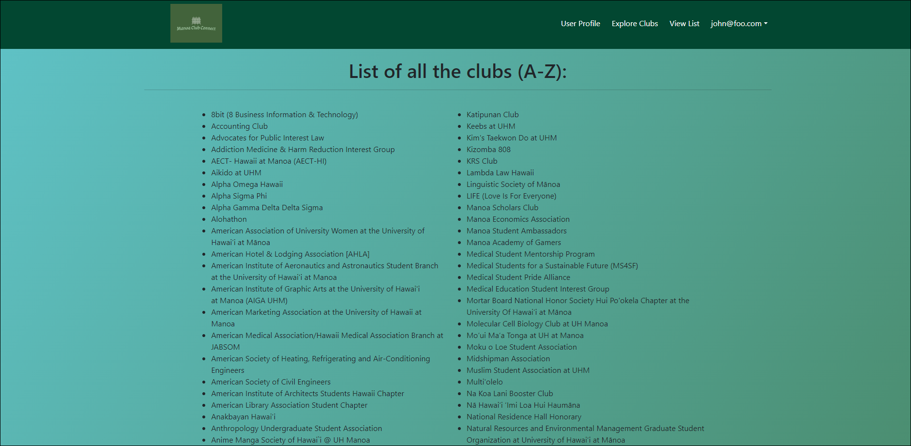

  

## Introduction

This fun group project was such an amazing experience to work on with other classmates. Although we have faced many issues and concerns about our idea, we managed to accomplish and create a functional working website. This website allows UH students to have access to a portal of all clubs that are available online and to keep in touch with the host. It's compatible with any electronic device because this app uses a UI framework in Meteor, React, Bootstrap, and MiniMongo. The group consisted of 5 students: Joshua Asuncion, Luis Hernandez, Christian Milanes, Byron Soriano, and, of course, me, Eisen Oallesma.

## Work Contribution

My contribution to the project were:

* Sign-out page
* Club list page, 
* Club collection
* Creating the superadmin page along with the access to the page.

There are many but minor other tasks from behind the work. Just a few tweaks and minor adjustments are required because tiny codes can have an impact on other programs.

Here is some of the works that my classmates have worked on:

  
  

And here is one of my work that I did:

  

## Lessons Learned

